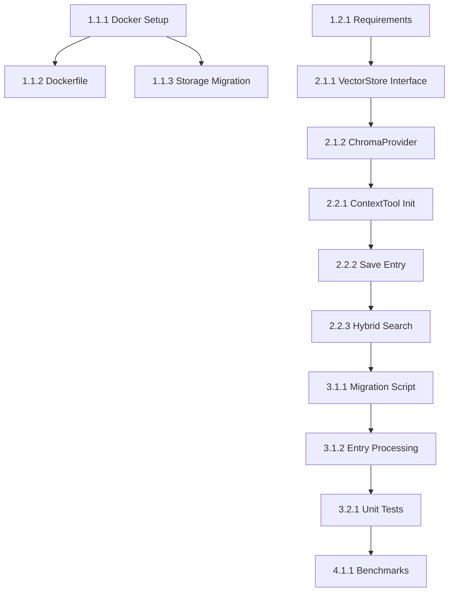

# Semantic Search Implementation Task List

## Overview
This document contains the complete task breakdown for implementing semantic search in the AI Context Management Tool using ChromaDB and multilingual-e5-large-instruct embeddings.

**Target Completion**: 4 weeks  
**Current Status**: Planning Phase  
**Strategy Document**: [AI_CONTEXT_SEMANTIC_SEARCH_STRATEGY.md](./AI_CONTEXT_SEMANTIC_SEARCH_STRATEGY.md)

## Task Tracking

### Phase 1: Foundation & Infrastructure (Week 1)

#### 1.1 Docker & Storage Setup
- [x] **Task 1.1.1**: Update `docker-compose.yml` to add persistent volumes
  - Add `zen_kb_data` volume for knowledge base
  - Add `zen_model_cache` volume for model storage
  - Mount volumes to appropriate paths in container
  - **Files**: Create or update `docker-compose.yml`
  - **Verification**: Run `docker-compose up` and verify volumes are created

- [x] **Task 1.1.2**: Create multi-stage Dockerfile for model pre-download
  - Create builder stage with sentence-transformers
  - Download `intfloat/multilingual-e5-large-instruct` model
  - Copy model to final stage
  - Set SENTENCE_TRANSFORMERS_HOME environment variable
  - **Files**: Update `Dockerfile`
  - **Verification**: Build image and verify model is included (~2.2GB)

- [x] **Task 1.1.3**: Update storage paths and implement migration
  - Change DEFAULT_KB_DIR from `/tmp/zen-context-kb` to `/data/kb`
  - Create startup migration script to move existing data
  - Add migration check to server startup
  - **Files**: `tools/context.py`, create `utils/migrate_storage.py`
  - **Verification**: Test with existing data in /tmp

#### 1.2 Dependency Management
- [x] **Task 1.2.1**: Update requirements.txt
  - Add latest `chromadb`
  - Add latest `sentence-transformers`
  - Verify compatibility with existing dependencies
  - **Files**: `requirements.txt`
  - **Verification**: `pip install -r requirements.txt` in fresh environment

- [x] **Task 1.2.2**: Update .gitignore
  - Add ChromaDB data directories
  - Add model cache directories
  - Add migration lock files
  - **Files**: `.gitignore`
  - **Verification**: Ensure no data files are tracked

### Phase 2: Core Implementation (Week 2)

#### 2.1 Vector Store Abstraction
- [x] **Task 2.1.1**: Create VectorStoreProvider interface
  - Define abstract base class with required methods
  - Include methods: add_entry, add_entries_batch, query, delete_entry, get_stats
  - Add proper type hints and docstrings
  - **Files**: Create `utils/vector_store.py`
  - **Verification**: Import and instantiate without errors

- [x] **Task 2.1.2**: Implement ChromaProvider class
  - Implement all VectorStoreProvider methods
  - Add model initialization with multilingual-e5-large-instruct
  - Implement instruction formatting for queries
  - Add error handling and logging
  - **Files**: Create `utils/chroma_provider.py`
  - **Verification**: Unit tests for each method

- [x] **Task 2.1.3**: Add AI-powered keyword extraction
  - Create extraction prompt optimized for Gemini Flash ✓
  - Use provider.generate() directly for keyword extraction ✓
  - Extract JSON array of 10-20 technical keywords ✓
  - Implement caching with hash-based keys ✓
  - AI-only approach (no fallback) for consistent quality ✓
  - **Files**: Updated `utils/chroma_provider.py`, created `test_keyword_extraction.py`
  - **Verification**: Test extraction quality with various content types ✓

#### 2.2 Context Tool Integration
- [x] **Task 2.2.1**: Add vector store initialization to ContextTool
  - Add ENABLE_VECTOR_SEARCH environment variable check
  - Initialize ChromaProvider if enabled
  - Handle initialization errors gracefully
  - **Files**: Update `tools/context.py`
  - **Verification**: Tool starts with and without vector search

- [x] **Task 2.2.2**: Update save_entry method
  - Add vector store indexing after file save
  - Include all metadata in vector store
  - Handle indexing failures without losing data
  - **Files**: Update `tools/context.py`
  - **Verification**: New entries appear in vector store

- [ ] **Task 2.2.3**: Implement hybrid search
  - Replace search_entries with hybrid search logic
  - Implement RRF (Reciprocal Rank Fusion) scoring
  - Combine semantic and keyword results
  - Add fallback to legacy search if vector store disabled
  - **Files**: Update `tools/context.py`
  - **Verification**: Search returns relevant results

### Phase 3: Migration & Testing (Week 3)

#### 3.2 Testing Suite
- [x] **Task 3.2.1**: Create unit tests for ChromaProvider
  - Test initialization and configuration
  - Test add/query/delete operations
  - Test error handling
  - Test keyword extraction
  - **Files**: Create `tests/test_chroma_provider.py`
  - **Verification**: All tests pass

- [x] **Task 3.2.2**: Create integration tests
  - Test end-to-end context tool operations
  - Test hybrid search accuracy
  - Test fallback mechanisms
  - Test migration process
  - **Files**: Create `tests/test_semantic_search_integration.py`
  - **Verification**: All tests pass

- [x] **Task 3.2.3**: Create simulator tests
  - Add semantic search test scenarios
  - Test search quality improvements
  - Test performance metrics
  - **Files**: Create `simulator_tests/test_semantic_search.py`
  - **Verification**: Run in Docker environment

### Phase 4: Optimization & Deployment (Week 4)

#### 4.1 Performance Optimization
- [x] **Task 4.1.1**: Implement performance benchmarks
  - Create benchmark script for search performance
  - Measure indexing speed
  - Compare with legacy search
  - **Files**: Create `benchmarks/semantic_search_performance.py`
  - **Verification**: Generate performance report

- [x] **Task 4.1.2**: Optimize batch processing
  - Tune batch sizes for embedding generation (32 for transformers)
  - Optimize ChromaDB insertion batches (100-500 items)
  - Add progress bars for long operations (tqdm integration)
  - **Files**: Updated `utils/chroma_provider.py`, added tqdm to `requirements.txt`
  - **Verification**: Improved processing speed with optimized batching

- [x] **Task 4.1.3**: Add monitoring and metrics
  - Add vector store statistics to logs ✓
  - Track search latencies ✓
  - Monitor memory usage ✓
  - **Files**: Updated `tools/context.py`, `utils/chroma_provider.py`, added `psutil` to `requirements.txt`
  - **Verification**: Created `test_monitoring_metrics.py` to verify metrics appear in logs

#### 4.2 Documentation & Deployment
- [x] **Task 4.2.1**: Update user documentation
  - Update AI_CONTEXT_TOOL_MANUAL.md with semantic search ✓
  - Add migration instructions ✓
  - Document new search capabilities ✓
  - **Files**: Updated `AI_CONTEXT_TOOL_MANUAL.md` to version 2.0
  - **Verification**: Documentation is complete with semantic search features

- [ ] **Task 4.2.2**: Create deployment checklist
  - List all environment variables
  - Document volume requirements
  - Add troubleshooting section
  - **Files**: Create `SEMANTIC_SEARCH_DEPLOYMENT.md`
  - **Verification**: Follow checklist successfully

- [ ] **Task 4.2.3**: Final testing and rollout
  - Run full test suite
  - Perform load testing
  - Test rollback procedure
  - Create release notes
  - **Files**: Update `CHANGELOG.md`
  - **Verification**: All systems operational

## Handoff Instructions

### For Next AI Agent

1. **Current State**: Check completed tasks above
2. **Environment Setup**:
   ```bash
   source venv/bin/activate
   pip install -r requirements.txt
   ./run-server.sh
   ```

3. **Key Files to Review**:
   - Strategy: `AI_CONTEXT_SEMANTIC_SEARCH_STRATEGY.md`
   - Current implementation: `tools/context.py`
   - This task list: `SEMANTIC_SEARCH_IMPLEMENTATION_TASKS.md`

4. **Testing Commands**:
   ```bash
   # Run quality checks
   ./code_quality_checks.sh
   
   # Test specific component
   python -m pytest tests/test_semantic_search.py -v
   
   # Run migration
   docker exec zen-mcp-server python migrate_to_semantic_search.py
   ```

5. **Common Issues**:
   - Model download may timeout - retry or pre-download
   - ChromaDB may need specific Python version (3.8+)
   - Docker volume permissions - ensure proper ownership

## Dependencies Between Tasks



## Success Criteria

1. **Functional**: Semantic search returns more relevant results than keyword search
2. **Performance**: Search latency < 100ms for 95% of queries
3. **Reliability**: Zero data loss during migration
4. **Usability**: Users can use natural language queries
5. **Maintainability**: Clear abstraction allows future vector DB changes

## Time Estimates

- **Phase 1**: 40 hours (1 week)
- **Phase 2**: 40 hours (1 week)
- **Phase 3**: 40 hours (1 week)
- **Phase 4**: 40 hours (1 week)
- **Buffer**: 20 hours for unexpected issues

**Total**: 180 hours (4-5 weeks at full-time pace)

---

*Last Updated: June 18, 2025*  
*Version: 1.0*